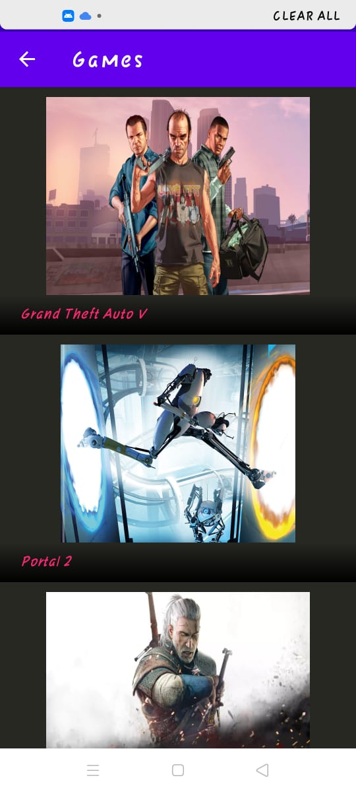
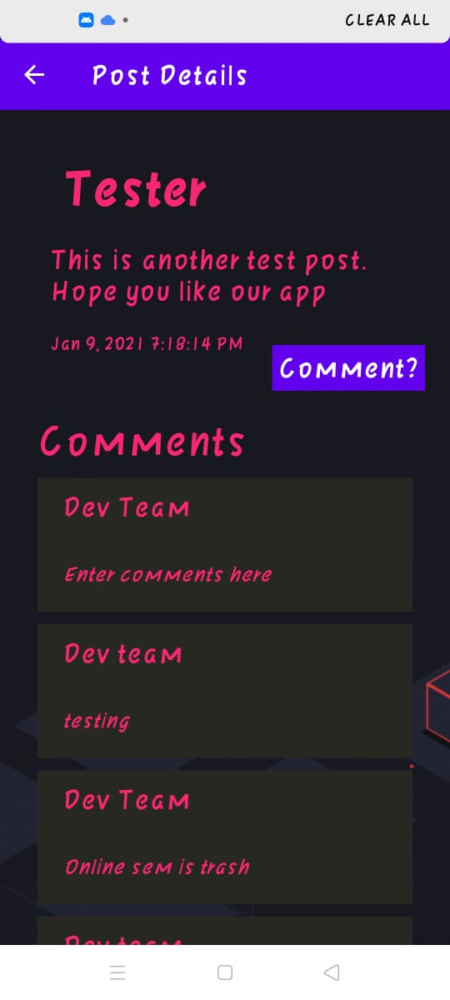
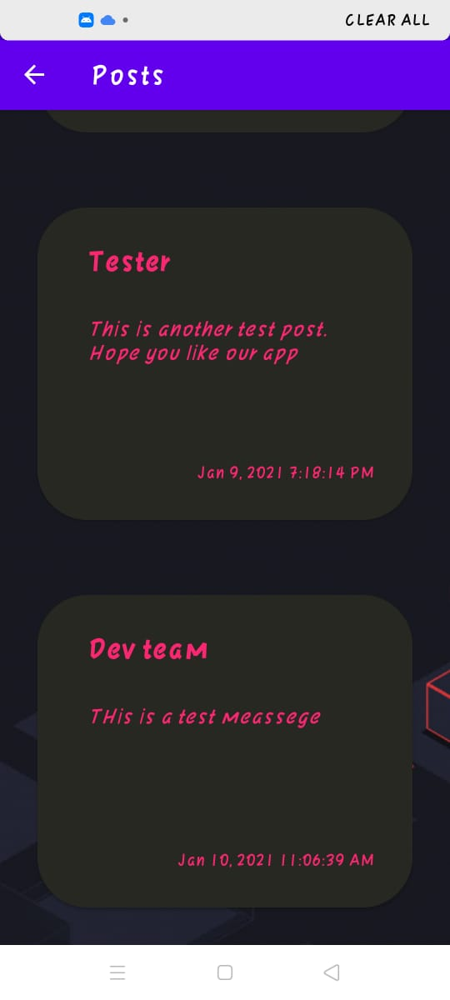
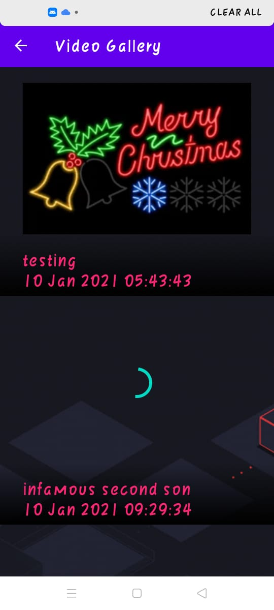

# Videospeil

An app to connect online gamers, bringing them together to share gaming streams and videos, make announcements and posts about the latest DLCs, gaming consoles and the hottest new releases.

Built 100% in Kotlin using MVVM architechture and best practices. 

Tech Stack  - 
* Paging 3 Library
* Retrofit
* Kotlin Coroutines and Flow
* Livedate
* Room Persistance Library
* Firebase

  &nbsp
   

 
 

  
   

 
 

  

